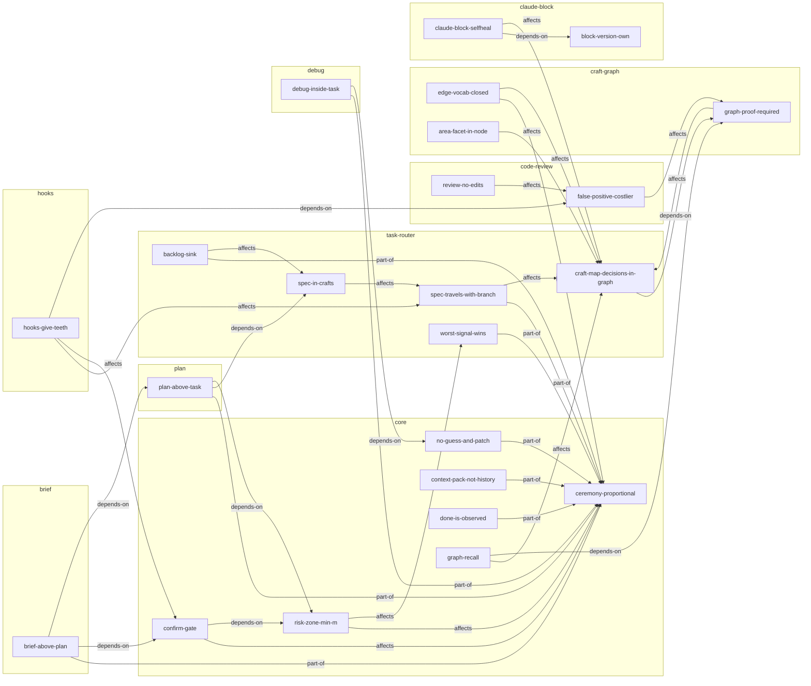

# Decision graph: craftlight

Updated: 2026-07-24

<!-- An overview for those without Obsidian: the nodes themselves navigate by [[wikilinks]];
     here is Mermaid for reading on GitHub. Grouped by the nodes' areas (subgraph = "Area:", 1:1);
     "core" — cross-cutting principles (≥2 subsystems). -->

## Digest
- **Hubs:** [[ceremony-proportional]] (12 edges — the root principle), [[craft-map-decisions-in-graph]] (7), [[graph-proof-required]] (4)
- **Tensions:** none — the graph has no `contradicts` edges
- **Questions:** which mode does a one-line fix in auth get? → [[risk-zone-min-m]]; may execution start if the user stays silent on the shown plan? → [[confirm-gate]]; when may a node be written without a `file:line` proof? → [[graph-proof-required]]

## Nodes
- [[ceremony-proportional]] — ceremony proportional to the task (the root principle)
- [[risk-zone-min-m]] — the risk zone → minimum M
- [[no-guess-and-patch]] — the ban on blind edits
- [[context-pack-not-history]] — a context pack for the subagent, not history (token-saving)
- [[confirm-gate]] — execution only after an explicit ok on the plan; an advance ok doesn't work in the risk zone
- [[done-is-observed]] — "done" = an observed result; "should work" is a forbidden phrasing
- [[graph-recall]] — the graph is read before a decision: brief/plan/task recon starts with it
- [[worst-signal-wins]] — the mode by the worst observed signal
- [[spec-travels-with-branch]] — SPEC = a state tracker, travels with the branch
- [[spec-in-crafts]] — the spec lives in docs/crafts/<slug>/ (a folder per task)
- [[backlog-sink]] — banning scope creep requires a sink: something foreign along the way → a line in _backlog.md
- [[craft-map-decisions-in-graph]] — CRAFT is "What it is" + the map, decisions into the graph; no PROJECT.md needed
- [[review-no-edits]] — a review doesn't edit code
- [[false-positive-costlier]] — a false positive costs more than a miss
- [[graph-proof-required]] — a graph node without proof doesn't exist
- [[edge-vocab-closed]] — the edge vocabulary is closed (5 types): expressiveness traded for cheapness
- [[area-facet-in-node]] — area: a facet in the node itself, the overview is derived from the nodes (1:1)
- [[claude-block-selfheal]] — self-maintenance of the block in CLAUDE.md
- [[block-version-own]] — the block version is its own, not the plugin version
- [[plan-above-task]] — plan sits above task: decomposing an initiative into a DAG and waves (plans, doesn't execute)
- [[brief-above-plan]] — brief sits above plan: decision by dialogue before the task (discusses, doesn't execute)
- [[debug-inside-task]] — debug sits below task: a diagnostic subcycle (hunts for the root, doesn't fix)
- [[hooks-give-teeth]] — hooks return rules and state to the context (advisory-only: state-push + gate-nudge; fail-open)

## Unplaced
- [[digest-derived-only]] — craft-graph
- [[l-cap-executor-detail]] — L/PLAN caps protect the reader; the cut-priority protects executor detail
