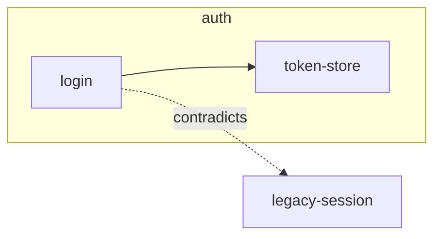

<!-- Form only. Behavior (who folds the queue, when) lives in the craft-graph playbooks — on conflict the
     playbook wins. These comments guide the write and are NOT copied into the artifact. Template edits stay read-compatible. -->
# Decision graph: <project>

Updated: <YYYY-MM-DD> <!-- set by a craft-graph pass only; writers outside craft-graph do NOT touch this line -->

<!-- An overview for those without Obsidian: the nodes themselves navigate by [[wikilinks]]; here is Mermaid for
     reading on GitHub. >~40 nodes → group into subgraphs by subsystem. Subgraph = the nodes' "Area:" (1:1);
     cross-cutting principles go in the subgraph "core", not a host subsystem. -->

## Digest
<!-- A derived analytical layer over the graph — where to start reading and where the tensions live.
     Every line must be computable from the nodes/edges already on disk (edge counts, contradicts
     edges, [[slug]] pointers); a claim not backed by a node does not belong here — it's a node or
     nothing. Rebuilt by craft-graph passes ONLY: any pass that edits the overview rebuilds it
     (cheap — recount edges); writers outside craft-graph append to Unplaced and touch nothing else,
     this section included. Caps: ~3 hubs, all contradicts edges (they're rare), ~3 questions;
     ~12 lines total. -->
- **Hubs:** [[<slug>]] (<N> edges), … <!-- most-connected nodes — entry points for a reader -->
- **Tensions:** [[<a>]] contradicts [[<b>]] — <the trade-off in one line>
- **Questions:** <a question the graph answers> → [[<slug>]] <!-- each MUST end with the answering pointer -->

## Nodes
<!-- All nodes one line each: [[slug]] — gist. Navigation for those without Obsidian. -->
- [[<slug>]] — <gist>

## Unplaced
<!-- The write-cheap queue, kept LAST so an append is an append-to-end (no structural parsing).
     A node born outside a craft-graph pass (e.g. a task wrap) appends `[[slug]] — area` here and touches
     nothing else — not the Mermaid, not the node list, not Updated. A craft-graph pass folds this queue into
     the Mermaid + node list and empties it: full sync is craft-graph's job, not each writer's. -->
- [[<slug>]] — <area>

<!-- File form: path docs/graph/_overview.md. Merge note: many branches append to Unplaced → set
     `docs/graph/_overview.md merge=union` in .gitattributes to avoid conflicts. -->
