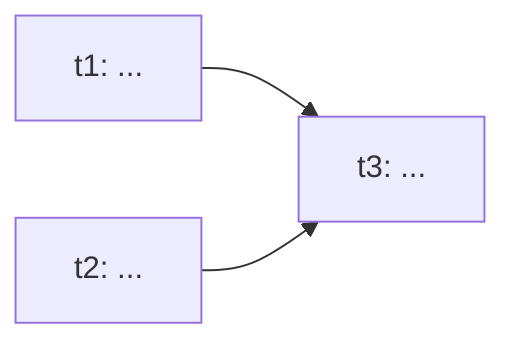

<!-- Form only: sections, field enums, formats, caps. Behavior (the gate, discussion, hand-off) lives in
     plan/SKILL.md — on conflict the playbook wins. These comments are write-time guidance, NOT copied into the
     artifact (inline enums excepted). Template edits stay read-compatible. -->
# PLAN: <initiative title>

Status: draft <!-- draft | in-progress | done | abandoned. Family enum: draft = gate ("ok, build") not passed
     (DAG still empty); in-progress = gate passed, waves running; abandoned = dropped on explicit request. -->
Initiative: <slug> <!-- folder docs/crafts/<slug>/; each leaf has its OWN branch and spec — the plan has no single branch -->

## Context
<!-- 3–5 lines: what the initiative is, why it arose, what already exists. No more. -->

## Goal
<!-- 1–2 lines: the initiative's result in system/user terms, not a list of actions. -->

## Discussion decisions
<!-- Outcomes of the multi-turn discussion: forks and what was chosen, REJECTED options and by what. What isn't
     visible from the task tree. No file:line proof here — the decisions show up in code at the tasks' wrap and
     then go into the graph (task's concern, not plan's). -->
-

## Assumptions
<!-- Reasonable assumptions instead of questions; the pre-ok ones first. -->
-

## Non-goals
<!-- What is deliberately outside the initiative. A mandatory section: an anchor against scope creep. -->
-

## Task DAG
<!-- Nodes = leaf tasks, edges = depends-on. Mermaid renders on GitHub. -->

## Tasks (leaves)
<!-- Size S/M/L is a HINT for the waves; task does the real classification at the leaf's start.
     Risk = the risk zone (the canonical list is the risk-zone line of the craftlight block in CLAUDE.md).
     The ✓ is ticked on resume from the child spec's status — task creates the spec at the leaf's start. -->
| id | Task | Size | Depends on | Risk | Spec (slug) | ✓ |
|----|------|------|-----------|------|-------------|---|
| t1 | <one-line goal> | M | — | no | `<t1-slug>` |   |
| t2 | ... | S | — | no | `<t2-slug>` |   |
| t3 | ... | M | t1, t2 | yes | `<t3-slug>` |   |

## Waves
<!-- Topological layers of the DAG: wave N depends only on waves < N; tasks within a wave are independent → parallel. -->
- **Wave 1** (parallel): t1, t2
- **Wave 2**: t3

## Contracts between tasks
<!-- Signatures, data formats, invariants at the seams — they let you start the next wave in a clean context. -->
-

## Log
<!-- A paragraph at each replanning / wave closure: what was closed, what changed in the DAG, what's next. -->

## Outcome
<!-- When all waves are closed: what came out, deviations; counters: tasks, waves, replannings. A real split
     into sub-initiatives → a `next: <initiative-2>` line here. -->

<!-- File form: cap ≤250 lines (Log and Outcome don't count — an append-only log). Hitting the cap →
     cut prose first (Context, Discussion-decisions wording), NEVER the task table, the DAG, or the
     Contracts between tasks — the plan is authored once and its leaves are executed many times; the
     seams are what let a wave start in a clean context. Lives in docs/crafts/<initiative>/PLAN.md;
     the child specs are flat neighbors docs/crafts/<leaf>/SPEC.md, NOT nested
     (else the task router's glob docs/crafts/*/SPEC.md won't find them). -->
