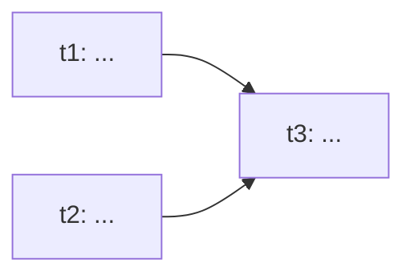

<!-- Form only: sections, field enums, formats, caps. Behavior (the gate, discussion, hand-off) lives in
     plan/SKILL.md — on conflict the playbook wins. These comments are write-time guidance, NOT copied into the
     artifact (inline enums excepted). Template edits stay read-compatible. -->
# PLAN: <initiative title>

Status: draft <!-- draft | in-progress | done | abandoned. Family enum: draft = gate ("ok, build") not passed
     (DAG still empty); in-progress = gate passed, waves running; abandoned = dropped on explicit request. -->
Initiative: <slug> <!-- folder docs/crafts/<slug>/; each leaf has its OWN branch and spec — the plan has no single branch -->

## Context
<!-- 3–5 lines: what the initiative is, why it arose, what already exists. No more. -->

## Goal
<!-- 1–2 lines: the initiative's result in system/user terms, not a list of actions. -->

## Discussion decisions
<!-- Outcomes of the multi-turn discussion: forks and what was chosen, REJECTED options and by what. What isn't
     visible from the task tree. No file:line proof here — the decisions show up in code at the tasks' wrap and
     then go into the graph (task's concern, not plan's). -->
-

## Assumptions
<!-- Reasonable assumptions instead of questions; the pre-ok ones first. -->
-

## Non-goals
<!-- What is deliberately outside the initiative. A mandatory section: an anchor against scope creep. -->
-

## Task DAG
<!-- Nodes = leaf tasks, edges = depends-on. Mermaid renders on GitHub. -->

```mermaid
graph LR
  t1[t1: ...]
  t2[t2: ...]
  t3[t3: ...]
  t1 --> t3
  t2 --> t3
```

## Tasks (leaves)
<!-- Size S/M/L is a HINT for the waves; task does the real classification at the leaf's start.
     Files/area is a HINT too — the folders/files the leaf is expected to touch, in one short cell (`skills/plan/`,
     `db + api`). It is what lets a wave be sanity-checked for disjointness before it runs; a hint, not a fence,
     and file-disjoint is not the same as semantically independent.
     Risk = the risk zone (the canonical list is the risk-zone line of the craftlight block in CLAUDE.md).
     The ✓ is ticked on resume from the child spec's status — task creates the spec at the leaf's start. -->
| id | Task | Size | Files/area | Depends on | Risk | Spec (slug) | ✓ |
|----|------|------|-----------|-----------|------|-------------|---|
| t1 | <one-line goal> | M | `<dir/>` | — | no | `<t1-slug>` |   |
| t2 | ... | S | `<dir/>` | — | no | `<t2-slug>` |   |
| t3 | ... | M | `<dir/>` | t1, t2 | yes | `<t3-slug>` |   |

## Waves
<!-- Topological layers of the DAG: wave N depends only on waves < N; tasks within a wave are independent → parallel.
     Wave branch: `wave/<initiative>-w<N>` — laid out by plan, used when the wave is actually run through the
     `wave` skill (leaf branches `task/<leaf>` are cut from it and merged back, so the wave lands as one PR).
     Leaves run one at a time instead → the field simply stays unused; plan never runs a wave itself. -->
- **Wave 1** (parallel): t1, t2 — Wave branch: `wave/<initiative>-w1`
- **Wave 2**: t3 — Wave branch: `wave/<initiative>-w2`

## Contracts between tasks
<!-- Signatures, data formats, invariants at the seams — they let you start the next wave in a clean context. -->
-

## Wave runs
<!-- Laid out EMPTY by plan and filled by the `wave` skill as a wave is run — plan plans, it doesn't run waves.
     One block per run, appended (a re-run of the same wave gets its own block, it doesn't overwrite the first):

       ### Wave <N> — `wave/<initiative>-w<N>`
       - Merge order: t2 → t1        (the order the leaves actually merged, not the planned one)
       - t2 — merged, `task/<t2-slug>`
       - t1 — stopped: <one line — what stopped it>, branch `task/<t1-slug>` left in place
       - Stopped at: <the wave's own halt, or `—` if it ran clean>

     A stopped leaf keeps its branch and its ✓ stays unticked: the block says where to resume, and the
     checkbox above never rests on an agent's claim. -->

## Log
<!-- A paragraph at each replanning / wave closure: what was closed, what changed in the DAG, what's next. -->

## Outcome
<!-- When all waves are closed: what came out, deviations; counters: tasks, waves, replannings. A real split
     into sub-initiatives → a `next: <initiative-2>` line here. -->

<!-- File form: cap ≤250 lines (Log, Wave runs, and Outcome don't count — append-only records). Hitting the cap →
     cut prose first (Context, Discussion-decisions wording), NEVER the task table, the DAG, or the
     Contracts between tasks — the plan is authored once and its leaves are executed many times; the
     seams are what let a wave start in a clean context. Lives in docs/crafts/<initiative>/PLAN.md;
     the child specs are flat neighbors docs/crafts/<leaf>/SPEC.md, NOT nested
     (else the task router's glob docs/crafts/*/SPEC.md won't find them). -->
